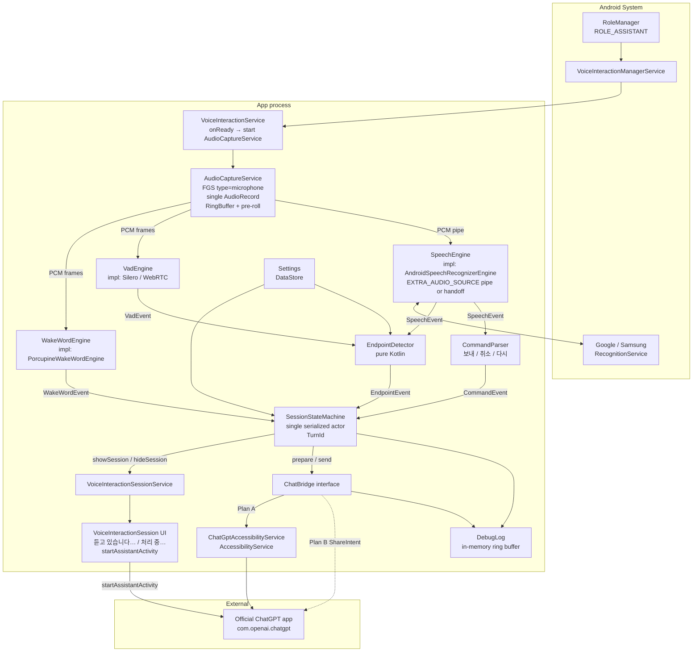
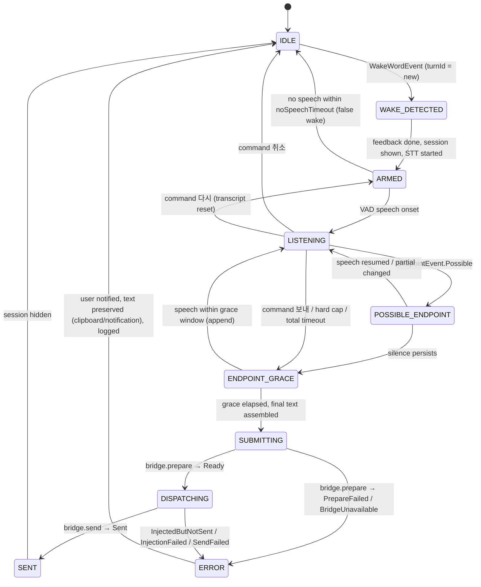

# ARCHITECTURE — ChatGPT Voice Receiver (codename AURA)

- 문서 상태: **Authoritative. 구현의 기준 문서.**
- 최종 갱신: 2026-09-18
- 결정 근거: [DECISIONS.md](DECISIONS.md) · 리뷰 원문: [ARCHITECTURE_REVIEW.md](ARCHITECTURE_REVIEW.md)
- 하위 설계: [ENDPOINT_ENGINE.md](ENDPOINT_ENGINE.md) · [CHATGPT_BRIDGE.md](CHATGPT_BRIDGE.md) · [ANDROID_CONSTRAINTS.md](ANDROID_CONSTRAINTS.md) · [SECURITY_PRIVACY.md](SECURITY_PRIVACY.md)

이 문서와 다른 문서가 충돌하면 **이 문서가 우선**한다. 단, 이 문서가 `DEVICE_TEST_REQUIRED`로 표시한 항목은 실기기 결과([GALAXY_VALIDATION.md](GALAXY_VALIDATION.md))로 갱신된다.

---

## 0. 상태 태그 규약

모든 설계 문서에서 동일하게 사용한다.

| 태그 | 의미 |
|---|---|
| `CONFIRMED` | 공식 문서(Android Developers / AOSP / Samsung Developers / 라이브러리 공식 문서)로 확인됨 |
| `SUPPORTED WITH LIMITATIONS` | 공식적으로 가능하나 제약이 있음 |
| `DEVICE_TEST_REQUIRED` | API·정책상 가능해 보이나 실제 Galaxy 동작은 검증 전 |
| `COMMUNITY_REPORTED` | 커뮤니티/개발자 보고만 있음. CONFIRMED로 취급하지 않음 |
| `OPEN_QUESTION` | 아직 조사되지 않음 |
| `NOT RECOMMENDED` | 가능하더라도 채택하지 않음 |
| `EXPERIMENTAL` | 채택했으나 언제든 깨질 수 있음. 자가진단·폴백 필수 |
| `DEFAULT_INITIAL_VALUE` / `DEVICE_TUNABLE` / `NOT A PRODUCT CONSTANT` | 숫자 파라미터에 붙임. 실측 전 실험 시작값 |

---

## 1. 최종 Architecture (한 장 요약)

```text
VoiceInteractionService  (system-bound, always alive while assistant role held)
        ↓ onReady()
AudioCaptureService  (FGS type=microphone)
        ↓
single AudioRecord  (16 kHz / mono / VOICE_RECOGNITION)
        ↓
RingBuffer (+ pre-roll)
        ├── WakeWordEngine      → WakeWordEvent
        ├── VadEngine           → VadEvent
        └── Speech pipeline     → SpeechEvent (partial / segment / final)
                                       ↓
                       EndpointDetector (pure Kotlin)
                                       ↓ EndpointEvent
                       SessionStateMachine (single serialized actor, TurnId)
                                       ↓
                                   ChatBridge  (interface)
                                       ├── ChatGptAccessibilityBridge   Plan A  EXPERIMENTAL
                                       ├── ShareIntentBridge            Plan B
                                       ├── (Plan C web fallback)
                                       └── FutureOfficialChatGptBridge  (reserved)
                                       ↓
                            Official ChatGPT Android App
```

**한 줄 원칙**

1. 마이크는 **한 component**(`AudioCaptureService`)만 연다. 나머지는 스트림 소비자다.
2. 상태 전이는 **한 actor**(`SessionStateMachine`)만 한다. 콜백은 이벤트를 큐에 넣을 뿐이다.
3. Send 시점은 **EndpointDetector**가 결정한다. `SpeechRecognizer`의 final은 segment 결과일 뿐이다.
4. ChatGPT UI에 대한 지식은 **ChatBridge 구현체 안에만** 존재한다.
5. 애매한 send 결과는 **절대 자동 재전송하지 않는다**.

---

## 2. Component Diagram



---

## 3. Module Boundaries

### 3.1 `core/` — pure Kotlin (JVM). Android 의존 금지

| 패키지 | 내용 | 비고 |
|---|---|---|
| `core.session` | `SessionStateMachine`, `SessionState`, `Event`, `TurnId`, `StateMachineActor` | 단위 테스트 필수 |
| `core.endpoint` | `EndpointDetector`, `EndingClassifier`, `EndingClass`, `EndpointThresholds`, `TranscriptStability` | 규칙 데이터는 외부 파일(`endpoint/ko/endings.yaml`) |
| `core.commands` | `CommandParser` | 마지막 어절만 검사 |
| `core.bridge` | `ChatBridge`, `ChatBridgeResult`, `BridgeReadiness`, `BridgeHealth` | 인터페이스와 결과 타입만 |
| `core.speech` | `WakeWordEngine`, `VadEngine`, `SpeechEngine` 인터페이스 + 이벤트 타입 | 구현 없음 |
| `core.settings` | 설정 스키마 (kotlinx.serialization) | threshold 등 tunable 값 |
| `core.log` | `DebugLog` ring buffer | transcript 마스킹 정책 포함 |

`core`는 Windows Phase 2에서 재사용 대상이다([DECISIONS.md](DECISIONS.md) ADR-010). 그래서 `android.*` import를 금지한다.

### 3.2 `app/` — Android

| 패키지 | 내용 |
|---|---|
| `app.assistant` | `GptVoiceInteractionService`, `GptSessionService`, `GptSession`(UI), `GptRecognitionService`(등록용 stub) |
| `app.audio` | `AudioCaptureService`(FGS), `RingBuffer`, `AudioRouter`(BT, v0.2) |
| `app.wakeword` | `PorcupineWakeWordEngine` |
| `app.vad` | `SileroVadEngine` (또는 WebRTC VAD) |
| `app.speech` | `AndroidSpeechRecognizerEngine`, `OnDeviceSpeechRecognizerEngine` |
| `app.chatgptbridge` | `ChatGptAccessibilityService`, `ChatGptAccessibilityBridge`, `ShareIntentBridge`, `SelectorStack`, `BridgeCalibrationActivity` |
| `app.settings` | DataStore, `SettingsActivity`, `OnboardingActivity` |
| `app.debug` | `LogViewerActivity`, export |
| `app.ui` | Compose 컴포넌트 (session card, onboarding) |

### 3.3 의존 방향

```text
app.*  →  core.*        (허용)
core.* →  app.*         (금지)
core.* →  android.*     (금지)
app.chatgptbridge  →  core.bridge   (허용)
core.session       →  core.bridge   (인터페이스만)
app.assistant / app.audio / app.speech  →  ChatGPT selector 지식   (금지)
```

이 문서 기준으로 `core/`, `app/`, `windows/`는 **아직 만들지 않는다**. 구조만 확정한다.

---

## 4. Audio Flow

### 4.1 원칙

**Only one component owns microphone capture.** `AudioCaptureService`가 `AudioRecord`를 하나만 연다.

- 포맷: 16 kHz, mono, 16-bit PCM, `MediaRecorder.AudioSource.VOICE_RECOGNITION` (초기값; Porcupine 요구 포맷과 일치)
- 서비스: FGS, `foregroundServiceType="microphone"`. `VoiceInteractionService.onReady()`에서 시작
- 마이크 사용 중 표시(privacy indicator)는 platform limitation으로 수용 ([ANDROID_CONSTRAINTS.md](ANDROID_CONSTRAINTS.md) §9)

### 4.2 RingBuffer

- 용량: 최소 2초 (초기값). Wake Word 감지 시점 기준 **pre-roll ~300 ms**(초기값, DEVICE_TUNABLE)를 STT에 함께 넘긴다.
- 소비자: `WakeWordEngine`(프레임 단위 512 samples), `VadEngine`(30 ms 프레임), Speech pipeline(연속 PCM).
- 소비자는 버퍼를 **읽기만** 한다. 쓰기는 `AudioCaptureService`만.

### 4.3 Wake → STT 전환 (두 가지 모드)

**Mode P — Pipe (우선 검토)** · `DEVICE_TEST_REQUIRED`

```text
Wake detected (t0)
→ RingBuffer의 t0 − pre-roll 부터를 ParcelFileDescriptor pipe로 노출
→ SpeechRecognizer.startListening(intent with EXTRA_AUDIO_SOURCE + EXTRA_SEGMENTED_SESSION)
→ AudioRecord는 계속 우리가 소유. STT는 pipe에서 읽음
→ EndpointDetector가 종료를 결정하면 pipe close → 세션 종료
```

- `EXTRA_AUDIO_SOURCE`(API 33)는 공식 문서상 "recognizer does not support this feature"인 경우 recognizer가 마이크를 직접 연다고 명시되어 있다. 즉 **지원 여부는 recognizer 구현체(Google/Samsung)에 달려 있다** → `DEVICE_TEST_REQUIRED` (GV-09).
- 장점: 마이크 소유권 이동 없음, 첫 음절 손실 없음, 세그먼트 세션으로 우리가 종료 시점 제어.

**Mode H — Handoff (fallback)** · `SUPPORTED WITH LIMITATIONS`

```text
Wake detected
→ AudioRecord.stop() (release)
→ acknowledgement sound / haptic  ← 사용자는 이 뒤에 말하도록 유도
→ SpeechRecognizer.startListening()  (recognizer가 자체 마이크 오픈)
→ STT 종료 후 AudioRecord 재시작
```

- 마이크 재획득 사이 100~300 ms 공백이 있다. Pre-roll 활용 불가. UX 피드백 타이밍으로 보완.
- Android 10+ 오디오 입력 공유 규칙상 두 앱이 동시에 열면 한쪽이 무음을 받을 수 있으므로, 반드시 **release 후** `startListening()`.

Mode 선택은 온보딩 시 1회 자가진단(pipe 시도 → 즉시 `ERROR_CLIENT`/무응답이면 Mode H 고정)으로 결정하고 설정에 저장한다.

### 4.4 오디오 일시정지 조건

`AudioManager.AudioRecordingCallback`로 다른 앱의 녹음/통화를 감지하면 Wake Word 감지를 일시정지한다(초기 정책). 통화 중 마이크 점유는 OS 우선순위로 우리가 무음을 받을 수 있다.

---

## 5. Data Flow (한 turn)

```text
[IDLE]
 AudioCaptureService ── PCM ──▶ WakeWordEngine
 WakeWordEngine ── WakeWordEvent(keywordIndex, t0) ──▶ SM.enqueue

[SM: IDLE → WAKE_DETECTED]  turnId = TurnId.next()
 SM ──▶ feedback (haptic, sound)
 SM ──▶ VSS.showSession("듣고 있습니다…")
 SM ──▶ SpeechEngine.start(turnId, pipe or handoff)
 SM ──▶ EndpointDetector.reset(turnId)

[SM: WAKE_DETECTED → ARMED]
 VadEngine ── VadEvent(speechOnset) ──▶ EndpointDetector ──▶ SM.enqueue(SpeechOnset)

[SM: ARMED → LISTENING]
 SpeechEngine ── SpeechEvent.Partial(text) ──▶ EndpointDetector, CommandParser
 VadEngine ── VadEvent(silenceMs) ──▶ EndpointDetector
 EndpointDetector ── EndpointEvent.Possible ──▶ SM.enqueue

[SM: LISTENING → POSSIBLE_ENDPOINT → ENDPOINT_GRACE]
 (grace 동안 speech 재개 시 LISTENING 복귀)

[SM: ENDPOINT_GRACE → SUBMITTING]
 SM: finalText = assembled segments (명령어 제거)
 SM ──▶ SpeechEngine.stop(turnId)
 SM ──▶ VSS.update("처리 중…")
 SM ──▶ ChatBridge.prepare(turnId)

[SM: SUBMITTING → DISPATCHING]
 SM ──▶ ChatBridge.send(turnId, finalText)

[SM: DISPATCHING → SENT | ERROR]
 SM ──▶ VSS.hideSession() (delay 후)
 SM ──▶ DebugLog

[SM: → IDLE]
 AudioCaptureService: Wake Word 감지 재개 (Mode H면 AudioRecord 재시작)
```

---

## 6. Session State Machine

### 6.1 States

```text
IDLE
WAKE_DETECTED
ARMED
LISTENING
POSSIBLE_ENDPOINT
ENDPOINT_GRACE
SUBMITTING
DISPATCHING
SENT
ERROR
```

### 6.2 Diagram



### 6.3 Race 규칙

| Race | 규칙 |
|---|---|
| Wake 2회 연속 | `WAKE_DETECTED`~`ENDPOINT_GRACE` 중 WakeWordEvent 무시(디바운스 2 s 초기값). `SUBMITTING`~`SENT` 중이면 `pendingWake = true`로 저장, IDLE 복귀 즉시 새 turn |
| STT partial 지연 도착 | `event.turnId != current.turnId` → 폐기. 같은 turn이라도 `SUBMITTING` 이후 도착한 partial은 폐기 |
| `취소` 후 final 도착 | turnId 불일치 → 폐기 |
| Endpoint 직후 speech | `ENDPOINT_GRACE` 창 안에서만 LISTENING 복귀. dispatch 이후 발화는 다음 turn(Wake Word 필요) |
| ChatGPT 실행 중 Wake | pendingWake 규칙 |
| Send 중복 | `sentFlag[turnId]` + composer 비움 검증 후에만 SENT. 검증 실패 시 **재클릭 금지**, `InjectedButNotSent`로 ERROR |
| Accessibility 이벤트 폭주 | `ChatGptAccessibilityService`는 이벤트를 SM에 넘기지 않는다. 자기 큐에서 코얼레싱, Bridge가 폴링으로 읽음 |
| Recognizer 재시작 | `segmentId` 단조 증가. `startListening` 전 이전 recognizer `cancel()`+`destroy()` 완료 대기 |

---

## 7. Concurrency Strategy

### 7.1 단일 직렬 이벤트 루프

`SessionStateMachine`은 **하나의 코루틴 actor**(또는 단일 스레드 `Channel` consumer)로 동작한다.

```kotlin
// 개념 스케치 — production code 아님
sealed interface Event { val turnId: TurnId? }

class SessionStateMachine(scope: CoroutineScope) {
    private val inbox = Channel<Event>(Channel.UNLIMITED)
    fun enqueue(e: Event) { inbox.trySend(e) }
    // scope.launch { for (e in inbox) reduce(state, e) }  ← 유일한 state 변경 지점
}
```

- `WakeWordEngine` / `VadEngine` / `SpeechEngine` / `ChatGptAccessibilityService` 콜백은 **`enqueue`만 호출**한다. 어떤 콜백도 state를 직접 읽거나 바꾸지 않는다.
- Bridge 호출(`prepare`, `send`)은 suspend 함수이며 actor 안에서 호출하되, 결과는 다시 `Event`로 취급한다(호출 중 도착한 다른 이벤트는 큐에 쌓인다).
- 타이머(grace, hard cap, no-speech timeout)는 actor가 `launch`한 delayed event로 구현하고, 상태가 바뀌면 `Job.cancel()`.

### 7.2 TurnId

```kotlin
@JvmInline value class TurnId(val value: Long)
```

- WakeWordEvent를 SM이 수락할 때 `TurnId.next()` 발급.
- 이후 그 turn에 관련된 **모든** 호출(`SpeechEngine.start`, `EndpointDetector.reset`, `ChatBridge.prepare/send`)과 **모든** 콜백 이벤트에 실린다.
- `event.turnId != current.turnId` → 즉시 폐기 + DebugLog에 `StaleEvent` 기록.
- `turnId == null`인 이벤트(예: 시스템 상태 변화)는 turn과 무관한 이벤트로 처리한다.

### 7.3 스레드 배치

| 작업 | 스레드 |
|---|---|
| `AudioRecord.read()` 루프 | 전용 스레드 (`THREAD_PRIORITY_URGENT_AUDIO`) |
| Porcupine / VAD 추론 | 오디오 스레드에서 프레임 단위 호출 (지연 시 별도 워커) |
| `SpeechRecognizer` 호출·콜백 | Main thread (플랫폼 요구) → 콜백은 즉시 `enqueue` |
| SessionStateMachine actor | 단일 `Dispatchers.Default.limitedParallelism(1)` |
| Accessibility 조작 | Accessibility service 스레드 → Bridge suspend 함수가 폴링 |

---

## 8. Failure Behavior

원칙: **질문을 조용히 잃지 않는다. 대신 중복 전송도 하지 않는다.**

| 실패 | 동작 |
|---|---|
| False wake (Wake 후 무발화) | `noSpeechTimeout`(4 s 초기값) 후 IDLE. 세션 UI 조용히 닫힘 |
| STT `ERROR_SPEECH_TIMEOUT` / `ERROR_NO_MATCH` | 세그먼트 재시작 1회. 재실패 시 "다시 말씀해 주세요" → IDLE |
| STT `ERROR_CLIENT` / `ERROR_RECOGNIZER_BUSY` | recognizer destroy → 재생성 1회. 재실패 시 ERROR |
| `ChatBridge.prepare` 실패 | Plan A → Plan B 자동 시도(같은 turnId). 모두 실패 시 텍스트를 **클립보드 + 알림**으로 보존, ERROR |
| `InjectedButNotSent` | **재전송 없음**. 사용자에게 "입력됨, 전송 버튼을 눌러주세요" 알림. ERROR |
| `SendFailed` (클릭했으나 composer 비워지지 않음) | **재클릭 없음**. 위와 동일 처리. 실제로 전송됐을 수도 있으므로 사용자가 확인 |
| Accessibility 서비스 비활성 | `BridgeUnavailable` → Plan B. 온보딩 배지로 상태 표시 |
| `AudioCaptureService` 사망 | VIS `onReady`/주기 점검(15분 초기값)에서 감지 → 재시작. 재시작 실패 3회 연속이면 알림 |
| 잠금 상태에서 turn 완료 | 텍스트를 큐에 보관, "잠금 해제 후 전송" 알림. `ACTION_USER_PRESENT`에서 dispatch (DEVICE_TEST_REQUIRED) |

---

## 9. Replacement Interfaces

모든 플랫폼 의존 요소는 인터페이스 뒤에 둔다. 아래는 계약 스케치이며 최종 시그니처는 구현 시 `core/`에서 확정한다.

### 9.1 WakeWordEngine

```kotlin
interface WakeWordEngine {
    fun start()
    fun stop()
    val events: Flow<WakeWordEvent>          // keywordIndex, detectedAtNanos
}
```

v0.1 구현 후보: `PorcupineWakeWordEngine`. 아키텍처는 Porcupine에 종속되지 않는다.

### 9.2 VadEngine

```kotlin
interface VadEngine {
    fun process(frame: ShortArray, timestampNanos: Long)
    val events: Flow<VadEvent>               // SpeechOnset, SpeechEnd(silenceMs), SilenceTick(silenceMs)
}
```

### 9.3 SpeechEngine

```kotlin
interface SpeechEngine {
    suspend fun start(turnId: TurnId, source: AudioSource)   // AudioSource.Pipe(fd) | AudioSource.Microphone
    suspend fun stop(turnId: TurnId)
    val events: Flow<SpeechEvent>            // Partial(text), Segment(text), Final(text), Error(code)
}
```

`SpeechEvent.Final`은 **segment 결과**다. 전송 신호가 아니다.

### 9.4 EndpointDetector

```kotlin
class EndpointDetector(thresholds: EndpointThresholds, classifier: EndingClassifier) {
    fun reset(turnId: TurnId)
    fun onVad(event: VadEvent): EndpointEvent?
    fun onTranscript(partial: String, timestampMs: Long): EndpointEvent?
}
```

Pure Kotlin. 오디오 프레임을 받지 않는다. VAD 이벤트와 transcript 이벤트만 받는다. 상세: [ENDPOINT_ENGINE.md](ENDPOINT_ENGINE.md).

### 9.5 ChatBridge

```kotlin
interface ChatBridge {
    suspend fun prepare(turnId: TurnId): BridgeReadiness
    suspend fun send(turnId: TurnId, text: String): ChatBridgeResult
    suspend fun healthCheck(): BridgeHealth
}

sealed interface ChatBridgeResult {
    data class Sent(val turnId: TurnId, val composerVerified: Boolean) : ChatBridgeResult
    data class InjectedButNotSent(val turnId: TurnId, val reason: String) : ChatBridgeResult
    data class PrepareFailed(val turnId: TurnId, val reason: String) : ChatBridgeResult
    data class InjectionFailed(val turnId: TurnId, val reason: String) : ChatBridgeResult
    data class SendFailed(val turnId: TurnId, val reason: String) : ChatBridgeResult
    data class BridgeUnavailable(val turnId: TurnId, val reason: String) : ChatBridgeResult
}
```

구현체(예정):

| 구현체 | Plan | 상태 |
|---|---|---|
| `ChatGptAccessibilityBridge` | A | `EXPERIMENTAL` / `DEVICE_TEST_REQUIRED` / `HIGH MAINTENANCE RISK` |
| `ShareIntentBridge` | B | `DEVICE_TEST_REQUIRED` (same conversation: NOT GUARANTEED) |
| (web `?q=` fallback) | C | emergency only |
| `OpenAiApiBridge` | — | 인터페이스만 예약. v0.1 요구(공식 앱 UI)와 상충 |
| `FutureOfficialChatGptBridge` | — | OpenAI가 deep link / intent / automation API / integration contract를 제공할 경우 교체 |

상세: [CHATGPT_BRIDGE.md](CHATGPT_BRIDGE.md).

---

## 10. Architecture Invariants

구현·리뷰 시 아래를 위반하는 코드는 머지하지 않는다.

```text
INV-1  Only one component owns microphone capture.
       (AudioCaptureService 외에 AudioRecord를 생성하는 코드는 없다.
        Mode H에서 SpeechRecognizer가 마이크를 열 때는 AudioCaptureService가 먼저 release한다.)

INV-2  No async callback directly mutates session state.
       (모든 콜백은 SessionStateMachine.enqueue(Event)만 호출한다.)

INV-3  Every turn-scoped event carries a TurnId; stale TurnId events are dropped, never applied.

INV-4  No ChatGPT selector logic exists inside core modules.
       (contentDescription 문자열, 패키지명, 노드 탐색 규칙은 app.chatgptbridge 안에만 있다.)

INV-5  No automatic resend after an ambiguous send result.
       (InjectedButNotSent / SendFailed 이후 같은 turnId로 send()를 다시 호출하지 않는다.)

INV-6  Endpoint engine decides send timing, not SpeechRecognizer final.
       (SpeechEvent.Final은 EndpointDetector의 입력이지 SUBMITTING 전이 조건이 아니다.)

INV-7  Idle audio never leaves the device.
       (IDLE/WAKE 대기 중 PCM은 로컬 WakeWordEngine/VadEngine에만 전달된다.)

INV-8  Numeric endpoint parameters are configuration, not code constants.
       (threshold / grace / hard cap / pre-roll은 Settings에서 읽는다.)

INV-9  No fixed absolute screen coordinates in any bridge.
       (좌표는 사용자가 보정한 화면 상대값만, 최후 폴백으로만.)

INV-10 A failed turn always preserves the user's text somewhere visible
       (clipboard or notification) before returning to IDLE.
```

---

## 11. 이 문서가 확정하지 않는 것

아래는 실기기 검증 후 이 문서를 갱신한다. 검증 절차는 [GALAXY_VALIDATION.md](GALAXY_VALIDATION.md).

| 항목 | 태그 | 검증 |
|---|---|---|
| Mode P(`EXTRA_AUDIO_SOURCE` pipe) 지원 여부 | DEVICE_TEST_REQUIRED | GV-09 |
| `EXTRA_SEGMENTED_SESSION` 동작 | DEVICE_TEST_REQUIRED | GV-10 |
| 화면 OFF / Doze 중 Wake 반응 | DEVICE_TEST_REQUIRED | GV-03, GV-05 |
| ChatGPT composer/Send 노드 노출 | DEVICE_TEST_REQUIRED | GV-11~13 |
| `startAssistantActivity`로 ChatGPT warm/cold 실행 결과 | DEVICE_TEST_REQUIRED | GV-14, GV-15 |
| Endpoint hard cap 3000 vs 4000 vs 5000 | DEVICE_TUNABLE | GV-19 |
| Samsung sleeping 정책 하 72h 생존 | DEVICE_TEST_REQUIRED | GV-07 |
| Bluetooth/Buds 입력 품질 | DEVICE_TEST_REQUIRED | GV-18 |
