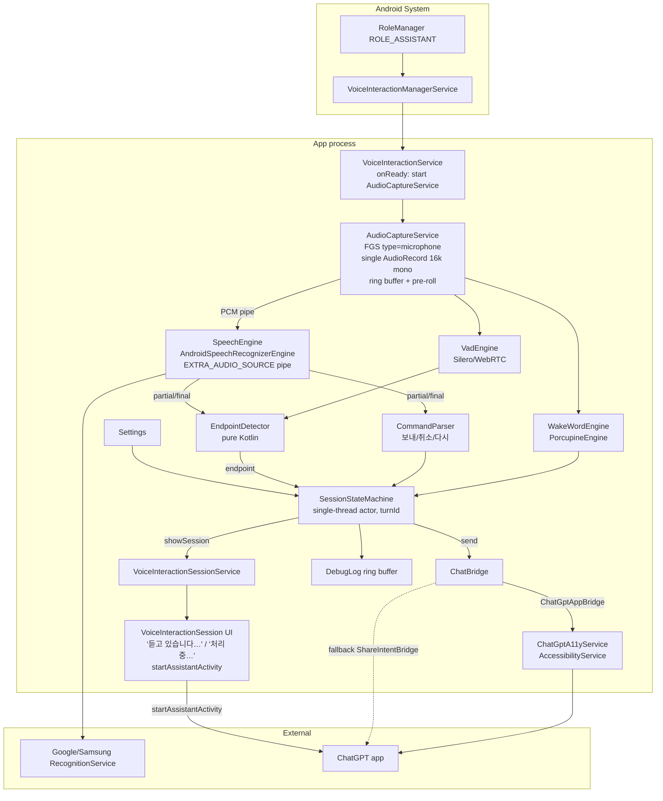
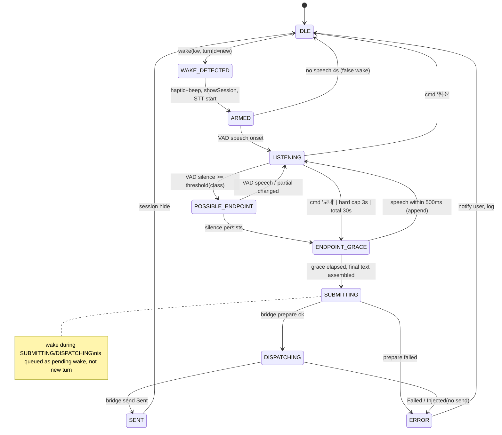

# ASTRA Architecture Review — Chatgpt-Voice-Reciever

> **문서 성격: 결정 과정의 기록(historical record). 구현 기준이 아니다.**
>
> 이 문서는 2026-09-18에 수행된 외부 아키텍처 리뷰의 원문이다. 실제 구현 기준(authoritative)은
> [ARCHITECTURE.md](ARCHITECTURE.md)와 그 하위 설계 문서들이며, 이 리뷰와 최종 문서가 다를 경우 **최종 문서가 우선**한다.
>
> 리뷰 이후 최종 문서에서 **수정된 판단**(자세한 근거는 [DECISIONS.md](DECISIONS.md)):
>
> | 리뷰의 표현 | 최종 문서의 판단 |
> |---|---|
> | §D "Accessibility ChatGPT injection = SUPPORTED WITH LIMITATIONS" | `DEVICE_TEST_REQUIRED` / `EXPERIMENTAL` / `HIGH RISK`. 실기기 검증 전 SUPPORTED 금지 ([CHATGPT_BRIDGE.md](CHATGPT_BRIDGE.md)) |
> | §A-3, §L-6 "같은 대화를 이어가려면 Accessibility 주입이 유일한 경로" | "현재 확인 가능한 방법 중 가장 현실적인 best-effort 경로". 향후 공식 integration을 `ChatBridge` 뒤에서 교체 가능하게 유지 |
> | §C-5, §F-2 `startAssistantActivity`로 ChatGPT 실행 | API 존재는 `CONFIRMED`, ChatGPT 실행 UX·warm/cold 대화 유지는 `DEVICE_TEST_REQUIRED` / `NOT GUARANTEED` ([ANDROID_CONSTRAINTS.md](ANDROID_CONSTRAINTS.md)) |
> | §C-8, §L-2 "Porcupine은 다중 키워드를 추가 비용 없이 감지" | 다중 키워드는 `SUPPORTED BY SDK`. 비용·라이선스는 `MUST BE VERIFIED AGAINST CURRENT PICOVOICE TERMS` |
> | §E-3 hard cap 3000 ms, grace 500 ms | 모두 `DEFAULT_INITIAL_VALUE` / `DEVICE_TUNABLE` / `NOT A PRODUCT CONSTANT`. 실기기에서 3000/4000/5000 ms 비교 ([ENDPOINT_ENGINE.md](ENDPOINT_ENGINE.md)) |
> | §I 문서 파일명 `ENDPOINTING.md` | `ENDPOINT_ENGINE.md`로 확정 |
> | §D "SpeechRecognizer(한국어) SUPPORTED" | API 자체는 `CONFIRMED`, Galaxy 기본 인식 서비스의 실제 동작·힌트 준수는 `DEVICE_TEST_REQUIRED` |
> | §C-6 Android 13+ Restricted Settings | 플랫폼 동작은 `COMMUNITY_REPORTED`, Samsung/One UI별 실제 동작은 `DEVICE_TEST_REQUIRED` |
>
> 리뷰 작성 시점에는 저장소에 접근할 수 없었으나(아래 "검토 범위 주의"), 최종 문서 작성 시점에는 README를 직접 대조했다.
> README의 기본 Wake Word "GPT"는 리뷰 §C-8에 따라 "헤이 지피티"로 변경했다.

- 검토일: 2026-09-18
- 검토 기준: Samsung Galaxy(One UI 7/8, Android 15/16) 실기기 동작 가능성
- 상태 태그: `CONFIRMED` / `DEVICE_TEST_REQUIRED` / `OPEN_QUESTION`

> **검토 범위 주의**
> `https://github.com/ssain3d-lgtm/Chatgpt-Voice-Reciever` 는 검토 시점에 404(비공개 또는 오타)로 접근 불가했다.
> 따라서 이 문서는 **요청서에 기술된 설계(§1~§15)** 를 대상으로 작성했다. 저장소 README/docs 문구와 이 문서의 차이는
> 접근 권한 확보 후 §M "기존 문서 반영 지침"에 따라 대조·반영해야 한다.

---

## A. Executive Review

방향은 맞다. VoiceInteractionService(VIS) 기반 + 모듈 분리 + ChatBridge 격리는 유지해야 한다.
그러나 현재 설계에는 실기기에서 바로 깨지는 가정이 네 개 있다.

1. **DSP 상시 웨이크워드는 3rd-party에 없다.** `AlwaysOnHotwordDetector`는 Android 12부터 `@SystemApi`이고 `CAPTURE_AUDIO_HOTWORD`가 필요하다. 우리는 앱 프로세스에서 `AudioRecord`를 직접 계속 돌려야 하며, 이 비용이 배터리·프라이버시 인디케이터 설계 전체를 지배한다.
2. **마이크 소유권 핸드오프가 설계에 없다.** 웨이크워드 `AudioRecord`와 `SpeechRecognizer`(다른 프로세스가 녹음)가 마이크를 주고받는 구간이 latency·race의 핵심인데 현재 설계에 언급이 없다. 해결책은 "오디오 스트림을 우리가 한 번만 열고 STT에 파이프로 넘기는 것"(`RecognizerIntent.EXTRA_AUDIO_SOURCE`, API 33)이다.
3. **ChatGPT 브릿지의 성공 조건이 "같은 conversation 유지"인데, 그것을 보장하는 공개 API는 없다.** Share intent는 새 대화를 만들고, `chatgpt.com/?q=`는 앱 composer를 채우지 않는다. 같은 대화를 이어가려면 Accessibility 주입이 유일한 경로이고, 따라서 이 브릿지는 "언제든 깨질 수 있는 부품"으로 격리·자가진단·자동 폴백까지 포함해 설계해야 한다.
4. **Endpoint 로직이 단어 목록 기반이라 한국어에서 오분류가 잦다.** "그", "하고", "일단"은 continuation이기도 하고 아니기도 하다. 단어 목록이 아니라 **마지막 어절의 어미 형태 + VAD 무음 길이 + partial 안정성**의 3층 구조로 바꿔야 한다.

나머지(상태머신, turnId, 추상화 계층, Windows 공유 개념)는 방향이 옳고 손질만 필요하다.

---

## B. What Is Correct (유지)

| 항목 | 판단 | 비고 |
|---|---|---|
| VIS를 Assistant foundation으로 선택 | 유지 | 3rd-party가 "항상 살아있는 프로세스 + 백그라운드 마이크 + 잠금화면 UI + 백그라운드 액티비티 실행"을 정책적으로 얻는 유일한 경로 |
| Wake word local-only, wake 이후에만 STT | 유지 | 프라이버시 원칙과 배터리 모두에 맞음 |
| Porcupine을 abstraction 뒤에 배치 | 유지 | Porcupine은 한국어(ko) 모델을 공식 지원. 교체 가능성 필수 |
| Android `SpeechRecognizer` 우선, on-device 옵션 | 유지 | 단, "연속 인식용이 아니다"라는 공식 주의를 세션 설계에 반영 |
| "전송" 명령은 fallback으로만 | 유지 | CommandParser에 `보내/취소/다시` 3개만 |
| ChatBridge 인터페이스 격리 | 유지 | 결과 타입을 더 세분화(아래 §F) |
| turnId 도입 | 유지 | 모든 콜백에 turnId를 실어 stale 이벤트 폐기 |
| 고정 좌표 클릭 회피 | 유지 | 단, 최후 폴백으로 "사용자가 한 번 지정한 상대좌표"는 허용 |
| Follow-up을 기본 OFF | 유지 | v0.1 제외 |
| SYSTEM_ALERT_WINDOW 회피 | 유지 | VIS 세션 창이 이를 대체 |
| Windows Phase 2 개념 공유 | 유지 | core 모듈을 순수 Kotlin으로 |

---

## C. What Is Wrong or Risky

### C-1. 상시 웨이크워드를 "OS가 처리해 줄 것"처럼 가정

- **Problem**: 설계가 "Wake Word를 항상 대기시킨다"고만 하고, 누가 마이크를 열고 있는지 정의하지 않음.
- **Why**: `AlwaysOnHotwordDetector`(DSP 저전력 감지)는 Android 12부터 SystemApi + `CAPTURE_AUDIO_HOTWORD` 권한 필요. 3rd-party 앱은 앱 프로세스에서 `AudioRecord`를 24시간 돌려야 한다. 이 경우 마이크 프라이버시 인디케이터(녹색 점)가 상시 표시된다.
- **Severity**: Critical
- **Evidence**: source.android.com Android 12 release notes ("AlwaysOnHotwordDetector … is a system API (@SystemApi) instead of a public API"); AOSP 커밋 "Check permission for VoiceInteraction" (CAPTURE_AUDIO_HOTWORD 요구).
- **Recommended Fix**: `AudioCaptureService`(FGS, `foregroundServiceType="microphone"`)를 VIS `onReady()`에서 시작. 단일 `AudioRecord`(16 kHz, mono, `VOICE_RECOGNITION`)를 열고 링버퍼로 Porcupine과 STT에 분배한다. 인디케이터 상시 표시는 수용하고, 설정에 "상시 대기 시간대/조건"(야간 OFF, 통화 중 OFF, 화면 OFF 시 선택)을 둔다.

### C-2. 마이크 핸드오프(웨이크 → STT) 미정의

- **Problem**: 웨이크 감지 후 `SpeechRecognizer.startListening()`을 호출하면 Google/Samsung 인식 서비스가 **자기 프로세스에서** 마이크를 연다. 우리 `AudioRecord`가 열려 있으면 Android 10+ 공유 규칙에 따라 둘 중 하나가 무음을 받거나, 닫고-여는 사이에 사용자의 첫 음절이 잘린다.
- **Why**: Android 10+는 마이크 입력 공유를 허용하지만 우선순위 규칙이 있고, 어시스턴트 예외는 조건부다. 핸드오프 100~300 ms 동안 사용자는 이미 말하기 시작한다.
- **Severity**: High
- **Evidence**: AOSP "Sharing Audio Input" 규칙; 요청서 UX("즉시 Listening 시작").
- **Recommended Fix**: `RecognizerIntent.EXTRA_AUDIO_SOURCE`(API 33)로 **우리가 소유한 스트림**을 STT에 파이프한다. 우리 링버퍼에 웨이크워드 직후 ~300 ms pre-roll을 포함해 넘기면 첫 음절 손실이 없다. 인식 서비스가 이 extra를 지원하는지는 `DEVICE_TEST_REQUIRED`(K-4). 미지원 시 폴백: 웨이크 감지 즉시 우리 `AudioRecord.stop()` → `startListening()` → 인식 종료 후 재개, 그리고 UX상 "삐" 피드백을 핸드오프 완료 시점에 울려 사용자가 그 뒤에 말하도록 유도.

### C-3. `SpeechRecognizer`의 자체 endpointing과 우리 endpointing의 충돌

- **Problem**: 설계는 우리가 endpoint를 판단해 전송한다고 하지만, Google 인식 서비스는 ~1–2 s 무음이면 스스로 세션을 끝내고 `onResults`를 낸다. "FastH3하고 음…" 뒤에 2 s 쉬면 우리 의도와 무관하게 세션이 종료된다.
- **Why**: `EXTRA_SPEECH_INPUT_COMPLETE_SILENCE_LENGTH_MILLIS` 등은 **힌트**이며 구현체가 무시할 수 있다. 공식 문서도 이 API가 연속 인식용이 아니라고 명시한다.
- **Severity**: High
- **Evidence**: developer.android.com `SpeechRecognizer` ("not intended to be used for continuous recognition"); `RecognizerIntent` extras 설명.
- **Recommended Fix**: (1) `EXTRA_SEGMENTED_SESSION`(API 33) + `EXTRA_AUDIO_SOURCE` 조합으로 한 세션 안에서 `onSegmentResults`를 여러 번 받고, **우리 EndpointDetector가 "발화 확정"을 내릴 때 세그먼트를 합쳐 전송**한다. (2) 세그먼트 세션 미지원 시: 엔진의 final을 "세그먼트"로 취급하고 즉시 `startListening()` 재호출(재시작 race는 turnId + segmentId로 방어). 어느 쪽이든 **엔진의 final ≠ 전송 신호**로 정의한다.

### C-4. Endpoint 로직이 단어 목록 기반

- **Problem**: continuation/filler/completion 단어 목록으로 판단.
- **Why**: 한국어는 문장 완결이 **어미(語尾)** 로 결정된다. "그" (filler vs 관형사 "그 방법"), "하고" (연결어미 vs "…하고 싶어" 완결), "일단" (부사, 문두/문중 모두 가능) 등 목록 항목이 양면적이다. STT partial은 조사·어미가 마지막에 바뀌는 경우가 많아 단어 매칭이 흔들린다.
- **Severity**: High
- **Evidence**: 요청서의 예시 목록 자체("그", "하고", "일단").
- **Recommended Fix**: §E의 3층 endpointer(VAD 무음 → 어미 형태 분류 → partial 안정성)로 교체. 단어 목록은 "어미 분류기의 예외 사전"으로만 남긴다.

### C-5. ChatGPT 브릿지에 "실행 경로"와 "실패 판정"이 없음

- **Problem**: "ChatGPT 앱 foreground 확인 → 없으면 실행"만 있고, 백그라운드에서 액티비티를 어떻게 띄우는지, 주입 성공을 어떻게 검증하는지, 두 번 전송을 어떻게 막는지가 없다.
- **Why**: Android 10+ 백그라운드 액티비티 시작 제한(BAL). 일반 서비스에서 `startActivity`는 차단된다. 또한 Compose UI는 `resource-id`가 없어(개발자가 `testTagsAsResourceId`를 켜지 않는 한) view id 기반 탐색이 불가능하다.
- **Severity**: Critical
- **Evidence**: BAL 제한 문서; Compose 접근성 문서(semantics tree 기반, resource-id 없음).
- **Recommended Fix**: 앱 실행은 **`VoiceInteractionSession.startAssistantActivity()`** 로 한다(어시스턴트 세션에 허용된 경로, BAL 예외). 주입은 §F의 "Selector Stack + Verify + Idempotent Send" 프로토콜로 한다.

### C-6. Accessibility 서비스 활성화의 Samsung/Android 13+ 장벽 미반영

- **Problem**: 사이드로드 APK는 Android 13+에서 Accessibility 활성화가 "제한된 설정"으로 막힌다(앱 정보 → 제한된 설정 허용 필요). 설계·온보딩에 없다.
- **Severity**: Medium
- **Recommended Fix**: 온보딩 체크리스트에 명시. Play/ADB(`adb install`은 예외)로 설치 시 차이도 문서화. `DEVICE_TEST_REQUIRED`(K-6).

### C-7. Samsung One UI 백그라운드 제한 대응 미정의

- **Problem**: One UI는 3일 미사용 앱을 sleeping(FGS 제한), 16일 미사용 시 deep sleeping으로 보낸다. 사용자가 "우리 앱 자체"를 열지 않고 음성으로만 쓰면 "미사용"으로 분류될 수 있다.
- **Severity**: High
- **Evidence**: developer.samsung.com "App management"(sleeping: Job/Alarm/FGS 제한, deep sleeping: 16일); Samsung 2024 공식 입장(One UI 6.0+, Android 14 타겟 FGS는 API 정책 준수 시 보장).
- **Recommended Fix**: (1) `targetSdk ≥ 34`, FGS type 정확히 선언. (2) 온보딩에서 "Never sleeping apps" 등록 + 배터리 최적화 제외 안내(둘의 상호작용은 OPEN_QUESTION — Samsung 포럼에 "최적화 제외 요청 시 never-sleeping 목록에서 빠진다"는 보고 있음). (3) VIS는 시스템이 바인딩하므로 그 자체는 살아있지만, **FGS가 죽었는지 VIS `onReady`/주기 점검으로 감시하고 재시작**. `DEVICE_TEST_REQUIRED`(K-9).

### C-8. Wake word "GPT" 단독은 부적합

- **Problem**: 3음절(지피티) 약어이며, 사용자의 일상 대화에 "ChatGPT", "GPT-5" 등이 빈번하다. YouTube 기술 영상에서도 자주 등장.
- **Severity**: High
- **Recommended Fix**: 기본 wake word를 **"헤이 지피티"(ko 모델)** 로 하고, 선택적으로 "Hey GPT"(en 모델) 병행. Porcupine은 다중 키워드를 추가 비용 없이 감지한다. 사용자 변경은 `.ppn` 파일 교체로 지원하되, 언어별 `params` 파일이 다르므로 "언어 → 모델 파일" 매핑을 설정 스키마에 포함.

### C-9. Follow-up window의 "응답 완료" 감지 수단이 없음

- **Problem**: "답변을 읽은 후 5~10초"라고 했지만 ChatGPT의 응답 완료 시점을 알 수단이 정의되지 않음.
- **Severity**: Medium
- **Recommended Fix**: v0.1 제외. v0.2에서 Accessibility로 "Stop 버튼 소멸/Send 버튼 재활성"을 완료 신호로 사용하는 실험만 허용. §J 참고.

### C-10. 비밀키·로그 정책은 있으나 "저장 위치"가 없음

- **Severity**: Low
- **Recommended Fix**: Porcupine AccessKey는 `local.properties` → `BuildConfig`(git 제외). 개인용 APK에서 완전한 은닉은 불가능함을 명시. 로그는 메모리 링버퍼(최근 200 이벤트) + debug 빌드에서만 파일 export.

---

## D. Android Reality Check

| 항목 | 판정 | 근거 |
|---|---|---|
| VoiceInteractionService(3rd-party) | **SUPPORTED** | 매니페스트에 `BIND_VOICE_INTERACTION` + `voice-interaction-service` 메타데이터 + **`RecognitionService` 컴포넌트도 반드시 선언**(없으면 목록에 안 뜸). 선택되면 시스템이 상시 바인딩·유지 |
| Assistant role(ROLE_ASSISTANT 지정) | **SUPPORTED** | 설정 → 기본 앱 → 디지털 어시스턴트. `RoleManager.createRequestRoleIntent(ROLE_ASSISTANT)`로 요청 가능. Samsung은 Bixby가 기본이므로 사용자가 바꿔야 함 |
| Always-on wake word | **SUPPORTED WITH LIMITATIONS** | DSP 경로(AlwaysOnHotwordDetector)는 3rd-party 불가. 앱 프로세스 `AudioRecord` 상시 캡처 → 배터리·녹색 인디케이터 상시 |
| Screen-off microphone | **SUPPORTED WITH LIMITATIONS** | VIS 소유 앱이 시작한 FGS는 while-in-use 마이크 예외에 명시됨("The service starts by an app which provides the VoiceInteractionService"). Doze 진입 후 CPU 스로틀 영향은 `DEVICE_TEST_REQUIRED`(K-8) |
| Lock-screen wake | **DEVICE_TEST_REQUIRED** | `supportsLaunchVoiceAssistFromKeyguard`로 세션 UI는 잠금 위 표시 가능. 그러나 ChatGPT 앱은 잠금 해제 없이는 볼 수 없음 → 잠금 상태에서는 "듣기+전송까지"만 하고 화면은 사용자가 해제하는 UX로 제한 |
| SpeechRecognizer(한국어) | **SUPPORTED** | Galaxy 기본 인식 서비스가 Google인지 Samsung인지는 `settings get secure voice_recognition_service`로 확인(K-3) |
| On-device STT(ko-KR) | **DEVICE_TEST_REQUIRED** | `isOnDeviceRecognitionAvailable()` + `checkRecognitionSupport(ko-KR)` 결과에 따름. 미지원 시 온라인 인식으로 자동 폴백 |
| Accessibility ChatGPT injection | **SUPPORTED WITH LIMITATIONS** | Compose 편집 필드는 접근성 트리에 `editable` + `ACTION_SET_TEXT` 노출. 다만 resource-id 없음, UI 업데이트마다 깨질 수 있음. 자가진단·폴백 필수 |
| ChatGPT automatic Send | **DEVICE_TEST_REQUIRED** | Send 버튼의 contentDescription/enabled 전이 확인 필요(K-5). 실패 시 share-intent 폴백 |
| Follow-up mode | **NOT RECOMMENDED (v0.1)** | 응답 완료 감지 수단 부재 + 오탐. v0.2 실험 항목 |
| Bluetooth microphone | **SUPPORTED WITH LIMITATIONS** | HFP/SCO(8–16 kHz) 또는 LE Audio. `AudioManager.setCommunicationDevice`(API 31)로 라우팅. 웨이크워드 정확도 저하 가능 → `DEVICE_TEST_REQUIRED`(K-10) |
| Samsung One UI background survival | **DEVICE_TEST_REQUIRED** | VIS 자체는 시스템 바인딩으로 생존. FGS는 sleeping 정책 대상 → Never sleeping 등록 후 72 h 관찰(K-9) |

---

## E. Endpoint Engine Review

### E-1. 결론

현재 "단어 목록 + silence" 설계는 **3층 구조**로 교체한다. 클라우드 LLM 호출 없음, 모두 로컬·규칙·경량 모델.

```
Layer 0  Acoustic   : 자체 VAD(Silero VAD ONNX 또는 WebRTC VAD)로 trailing silence(ms) 측정
Layer 1  Linguistic : partial transcript의 마지막 어절 → {FINAL, CONNECTIVE, FILLER, UNKNOWN}
Layer 2  Stability  : partial 텍스트가 마지막으로 바뀐 뒤 경과 시간
```

세 층은 각각 "기다림 시간(threshold)"을 산출하고, EndpointDetector는 `silence_ms >= threshold` 이면 endpoint 후보를 낸다.

### E-2. 어미 분류 규칙(Layer 1)

STT partial의 마지막 어절을 **오른쪽에서 왼쪽으로** 매칭한다. 목록은 예시이며 `endpoint/ko/endings.yaml`로 외부화한다.

| 클래스 | 패턴(어절 끝) | 예 |
|---|---|---|
| FINAL_IMPERATIVE | `줘`, `주세요`, `해`, `해라`, `봐`, `봐줘` | 확인해줘, 정리해봐 |
| FINAL_QUESTION | `?`, `어?`, `나?`, `까?`, `니?`, `지?`, `가?`, `야?`, `는데?` (물음표 없이 `까`, `나요`, `가요`, `습니까`) | 되나, 맞아, 가능한가 |
| FINAL_DECLARATIVE | `다`, `야`, `요`, `어`, `네`, `지`, `거든` | 궁금해, 알고 싶어 |
| CONNECTIVE | `고`, `는데`, `ㄴ데`, `서`, `면`, `면서`, `니까`, `지만`, `하고`, `이랑`, `랑`, `과`, `와`, `에서`, `에`, `을`, `를`, `이`, `가`, `은`, `는` (조사로 끝남) | FastH3하고, 기존 방식이 |
| CONJ_WORD | 어절 전체가 `그리고`, `그런데`, `근데`, `그러니까`, `그래서`, `그럼`, `일단`, `그` | 그리고… |
| FILLER | 어절 전체가 `음`, `어`, `아`, `저기`, `잠깐`, `그게`, `뭐지` | 음… |
| UNKNOWN | 그 외 | 고유명사, 영문 토큰(FastH3) |

주의 사항(현재 목록의 오류 교정):
- "하고"는 `…하고 싶어`처럼 FINAL 앞에 올 수 있으므로 **어절 끝** 기준으로만 CONNECTIVE.
- "그"는 단독 어절일 때만 CONJ_WORD/FILLER. "그 방법"의 "그"는 다음 어절이 오므로 partial이 바뀌어 Layer 2가 처리.
- 영문 토큰(FastH3, H3)로 끝나면 UNKNOWN → 중간값 대기. 한국어 문장에서 영문 명사로 끝나는 경우는 대부분 미완결이다.

### E-3. 임계값(초기값, 실측 후 조정)

| 마지막 어절 클래스 | threshold(ms) |
|---|---|
| FINAL_IMPERATIVE / FINAL_QUESTION | 600 |
| FINAL_DECLARATIVE | 800 |
| UNKNOWN | 1100 |
| CONNECTIVE / CONJ_WORD | 1800 |
| FILLER | 2200 |
| **hard cap(어떤 클래스든)** | **3000** → 강제 endpoint |
| 발화 전체 hard timeout | 30000 |
| 웨이크 후 첫 음성 없음 | 4000 → 취소(false wake 복구) |

적응 규칙:
- Layer 2: partial이 마지막으로 바뀐 뒤 `stability_ms`. `stability_ms < 300`이면 threshold에 +300(엔진이 아직 쓰는 중).
- 사용자 속도 적응: 최근 20턴의 "endpoint 후 재개(false positive endpoint)" 비율이 10 % 초과면 모든 threshold ×1.2, 2 % 미만이면 ×0.9. 범위 [0.7, 1.5]. 설정에 "빠르게/보통/여유" 프리셋 노출.

### E-4. 오류 복구

- **너무 빨리 끊음(false endpoint)**: `ENDPOINT_CONFIRMED` 후 **grace 500 ms** 동안 VAD가 음성을 다시 잡으면 `LISTENING`으로 복귀하고 텍스트를 이어 붙임(dispatch 전이므로 비용 0). dispatch 이후에 다시 말하면 그 발화는 **다음 turn**이 되어 같은 대화에 후속 메시지로 전송된다(설계상 허용).
- **너무 오래 기다림(missed endpoint)**: hard cap 3 s가 상한. 사용자 fallback 명령 `보내`/`전송`은 CommandParser가 즉시 endpoint로 처리하고 해당 단어는 전송 텍스트에서 제거.
- **STT 무응답**: `onError(ERROR_SPEECH_TIMEOUT/NO_MATCH)` → 세그먼트 재시작 1회, 그래도 실패면 UI에 "다시 말씀해 주세요" 후 IDLE.

### E-5. 왜 VAD를 따로 두는가

`SpeechRecognizer`는 RMS(`onRmsChanged`)만 주고 무음 길이를 안 준다. 자체 VAD가 있어야 (1) 무음 ms를 정확히 재고, (2) 엔진이 세션을 먼저 끊어도 우리 판단을 유지하고, (3) Windows에서 같은 로직을 재사용한다. Silero VAD는 30 ms 프레임, CPU 미미. `EndpointDetector`는 오디오 프레임이 아니라 **VAD 이벤트 + partial 이벤트만** 입력받는 순수 Kotlin 클래스로 만들어 단위 테스트한다.

`OPEN_QUESTION`: 문말 억양(상승조=의문) 피처 추가 여부. 효과는 있으나 pitch 추출 비용·복잡도가 있어 v0.3 이후.

---

## F. ChatGPT Bridge Review

### F-1. 요구사항 재정의

"공식 ChatGPT 앱, 로그인된 Plus 계정, **같은 conversation에 이어서** 보낸다."
이 중 **같은 conversation** 이 모든 것을 결정한다. 공개 경로들의 상태:

| 경로 | 같은 대화 유지 | 자동 Send | 안정성 | 판정 |
|---|---|---|---|---|
| Accessibility 주입(현 설계) | 가능(현재 열린 대화에 입력) | 가능 | UI 변경에 취약 | **Plan A** |
| `ACTION_SEND` share intent | 불가(새 대화) — `DEVICE_TEST_REQUIRED`(K-5b) | 불가(Send 탭 필요; Accessibility로 보완 가능) | 높음 | **Plan B(폴백)** |
| `chatgpt.com/?q=` (웹) | 불가(새 대화) | 웹은 prefill 확인. 2025-07 OpenAI가 sec-fetch-site 기반 auto-submit 보호를 넣어 외부 진입 시 자동 전송이 막힐 수 있음. 앱은 `?q=`로 composer를 채우지 않음(커뮤니티 보고) | 중 | **Plan C** |
| ChatGPT 앱을 기본 어시스턴트로 두고 그 음성모드 사용 | 별개 UX(실시간 음성) | — | 높음 | 요구사항과 다름. 참고만 |
| OpenAI API | 별도 대화 | 가능 | 최고 | Plus UI 요구와 상충. 인터페이스만 예약 |

**최종 추천 기본 경로: Plan A(Accessibility) + Plan B 자동 폴백.**

### F-2. Plan A 상세 — 유지 가능하게 만드는 조건

1. **실행**: 세션에서 `startAssistantActivity(launcherIntentOf("com.openai.chatgpt"))`. 앱이 recents에 살아 있으면 마지막 화면(직전 대화)으로 복귀하고, cold start면 새 대화 화면일 가능성이 높다(`DEVICE_TEST_REQUIRED` K-5a). "같은 대화"는 **best-effort** 로 문서화.
2. **대기**: `AccessibilityEvent.TYPE_WINDOW_STATE_CHANGED`에서 `packageName == com.openai.chatgpt` 확인 후 **composer 노드가 나타날 때까지** 최대 4 s 폴링(200 ms). 이벤트 폭주 대비 `notificationTimeout=100`, `packageNames` 필터.
3. **Selector Stack**(위에서부터 시도, 성공한 규칙을 저장):
   - S1 사용자 학습 시그니처: 온보딩 "브릿지 보정"에서 한 번 성공한 노드의 `(className, contentDescription, hintText, bounds의 화면 상대 위치)`.
   - S2 휴리스틱: `isEditable && isVisibleToUser && isFocusable` 이고 화면 하단 40 % 안의 노드 → composer. Send는 composer와 같은 부모 또는 형제 subtree에서 `isClickable && (contentDescription ∈ {Send, 보내기, 전송, …})` .
   - S3 최후: 사용자가 보정 화면에서 지정한 **상대 좌표**(`dispatchGesture`).
4. **주입**: `ACTION_SET_TEXT`(`ACTION_ARGUMENT_SET_TEXT_CHARSEQUENCE`). Compose 편집 필드는 이 액션을 지원한다. 실패 시 `ACTION_FOCUS` → 클립보드 → `ACTION_PASTE`(클립보드 사용은 로그에 남기고 즉시 클립보드 비움).
5. **검증**: 주입 후 composer의 `text`가 기대값과 일치하고 Send 노드가 `isEnabled` 로 바뀔 때까지(최대 1.5 s) 대기. 불일치면 재시도 1회 후 실패.
6. **Idempotent Send**: `turnId`별 `sent=false` 플래그. `ACTION_CLICK` 1회 후 300 ms 내 composer가 비면 성공. 비지 않으면 **재클릭하지 않고** 실패로 보고(이중 전송보다 미전송이 낫다).
7. **자가진단**: 앱 시작·ChatGPT 업데이트 감지(`PACKAGE_REPLACED`) 시 "브릿지 상태" 배지. 실패 3회 연속이면 Plan B로 자동 전환하고 알림.
8. **IME 간섭**: `ACTION_SET_TEXT`는 IME 없이 동작. 키보드가 올라와 Send가 가려지는 경우는 `dispatchGesture` 대신 노드 액션이라 영향 없음. 단 Samsung 키보드 자동완성 툴바가 노드 트리를 흔드는지 `DEVICE_TEST_REQUIRED`.
9. **잠금 상태**: 잠금 중에는 `startAssistantActivity`가 잠금 해제 화면을 띄운다. 정책: 잠금 상태면 텍스트를 큐에 넣고 "잠금 해제 후 전송" 알림, 해제 감지(`ACTION_USER_PRESENT`) 시 전송.

### F-3. Plan B — Share intent

- `Intent(ACTION_SEND).setType("text/plain").setPackage("com.openai.chatgpt").putExtra(EXTRA_TEXT, q)` 를 `startAssistantActivity`로 실행.
- 새 대화가 열리므로 후속 질문은 자동으로 이어지지 않는다. 대신 텍스트 앞에 "(이전 질문 이어서)" 같은 접두어는 **넣지 않는다**(사용자 텍스트 오염 금지).
- Send 자동 클릭은 Accessibility가 살아 있으면 S2로 시도, 아니면 사용자 탭.
- 존재 여부 확인: `adb shell pm query-activities -a android.intent.action.SEND -t text/plain | grep -i openai` (K-5b).

### F-4. Plan C — 웹 `?q=`

- `Custom Tabs`로 `https://chatgpt.com/?q=<urlencoded>` 열기. 브라우저 로그인 세션 필요. 자동 전송이 막히면 Accessibility로 Send 클릭.
- 7,500자 근처에서 431 오류 보고가 있으므로 텍스트 길이 제한.
- 앱 UI 요구와 맞지 않아 **긴급 폴백** 으로만.

### F-5. ChatBridge 인터페이스 보강

```kotlin
interface ChatBridge {
    suspend fun prepare(turnId: TurnId): BridgeReadiness       // 앱 실행/포그라운드 확보
    suspend fun send(turnId: TurnId, text: String): ChatBridgeResult
    fun healthCheck(): BridgeHealth                            // Selector Stack 자가진단
}
sealed interface ChatBridgeResult {
    data class Sent(val turnId: TurnId, val composerVerified: Boolean) : ChatBridgeResult
    data class Injected(val turnId: TurnId) : ChatBridgeResult    // 텍스트만 넣고 Send 실패
    data class Failed(val turnId: TurnId, val stage: Stage, val reason: String) : ChatBridgeResult
}
```

---

## G. Recommended Final Architecture



핵심 원칙:
- **오디오는 한 곳(FGS)에서만 연다.** 나머지는 스트림 소비자.
- **상태 전이는 한 스레드(actor)에서만.** 모든 콜백은 `Event(turnId, ...)`로 큐에 넣는다.
- **세션 UI는 VIS 세션 창.** 오버레이 권한 없음.
- **브릿지는 교체 가능하고 자가진단한다.**

---

## H. Recommended State Machine



Race 처리 규칙:
| Race | 규칙 |
|---|---|
| wake 2회 연속 | `WAKE_DETECTED`~`ENDPOINT_GRACE` 중 wake 이벤트는 무시(디바운스 2 s). `SUBMITTING`~`SENT` 중 wake는 `pendingWake=true`로 저장, IDLE 복귀 즉시 새 turn |
| STT partial 지연 도착 | `event.turnId != current.turnId` → 폐기. 같은 turn이라도 `SUBMITTING` 이후 partial은 폐기 |
| cancel 후 final 도착 | turnId 불일치로 폐기 |
| endpoint 직후 speech | `ENDPOINT_GRACE` 500 ms 창에서만 복귀 허용 |
| ChatGPT 실행 중 wake | 위 pendingWake 규칙 |
| Send 두 번 클릭 | `sentFlag[turnId]` + composer 비움 검증 후에만 SENT |
| app switch 중 a11y 이벤트 폭주 | a11y 서비스는 이벤트를 상태머신에 넘기지 않고 **자기 큐에서 코얼레싱**, 브릿지가 폴링으로 읽음 |
| recognizer restart race | `segmentId` 단조 증가, `startListening` 전 이전 recognizer `cancel()` + `destroy()` 완료 대기 |

---

## I. Repository Structure

```
Chatgpt-Voice-Reciever/
├── docs/
│   ├── ARCHITECTURE.md              # 확정안(이 리뷰 반영)
│   ├── ASTRA_ARCHITECTURE_REVIEW.md # 이 문서
│   ├── ENDPOINTING.md               # §E 규칙·임계값·실측 로그
│   ├── CHATGPT_BRIDGE.md            # §F 프로토콜·selector 시그니처·폴백
│   ├── GALAXY_VALIDATION.md         # §K 체크리스트 + 결과 기록
│   └── DECISIONS.md                 # §L (ADR 형식, 번호 증가)
├── core/                            # 순수 Kotlin(JVM). Android 의존 금지. Windows 재사용 대상
│   └── src/main/kotlin/…/core/
│       ├── session/   SessionStateMachine, Event, TurnId, StateMachineActor
│       ├── endpoint/  EndpointDetector, EndingClassifier(ko), Thresholds, AdaptiveTuner
│       ├── commands/  CommandParser
│       ├── bridge/    ChatBridge, ChatBridgeResult, BridgeHealth
│       ├── speech/    SpeechEngine, WakeWordEngine, VadEngine (interfaces + events)
│       ├── settings/  SettingsSchema (kotlinx.serialization)
│       └── log/       DebugLog(ring buffer)
├── app/                             # Android
│   └── src/main/kotlin/…/
│       ├── assistant/   GptVoiceInteractionService, GptSessionService, GptSession(UI), GptRecognitionService(stub, 등록용)
│       ├── audio/       AudioCaptureService(FGS), RingBuffer, AudioRouter(BT)
│       ├── wakeword/    PorcupineWakeWordEngine
│       ├── vad/         SileroVadEngine
│       ├── speech/      AndroidSpeechRecognizerEngine, OnDeviceSpeechRecognizerEngine
│       ├── chatgptbridge/ ChatGptA11yService, ChatGptAppBridge, ShareIntentBridge, SelectorStack, BridgeCalibrationActivity
│       ├── settings/    DataStore, SettingsActivity, OnboardingActivity(권한·역할·Never sleeping)
│       ├── debug/       LogViewerActivity, export
│       └── ui/          Compose components for session/onboarding
├── windows/                         # Phase 2 placeholder (README only)
└── scripts/
    └── galaxy/   adb 진단 스크립트(K-*.sh)
```

변경 이유: 요청서의 `assistant/wakeword/speech/endpoint/commands/session/chatgptbridge/settings/debug`는 유지하되, **Android 비의존 로직을 `core`로 분리**해 Windows 재사용과 단위 테스트를 강제. `audio/`와 `vad/`가 추가됨(§C-1, §E-5).

---

## J. MVP Scope

**v0.1 (반드시)**
- VIS + Session UI("듣고 있습니다…/처리 중…"), ROLE_ASSISTANT 온보딩
- FGS 단일 AudioRecord + Porcupine "헤이 지피티"(ko). 사용자 변경 UI 없음(파일 교체만)
- Silero VAD + EndpointDetector v1(§E 규칙, 고정 임계값, 적응 OFF)
- SpeechRecognizer(온라인/온디바이스 자동), 세그먼트 세션 시도 → 실패 시 재시작 방식
- CommandParser: `보내/전송`, `취소`, `다시`
- ChatGptAppBridge(Plan A) + ShareIntentBridge(Plan B) 자동 폴백 + 보정 화면
- DebugLog 링버퍼 + 뷰어
- 잠금 상태: 큐잉 후 해제 시 전송

**v0.2**
- 적응 임계값, 사용자 프리셋
- Bluetooth 라우팅 정책(차량/Buds)
- Follow-up 실험(응답 완료 감지 성공 시에만)
- 상시 대기 스케줄(야간 OFF)

**v0.3+**
- Whisper/온디바이스 대체 STT 엔진, 억양 피처
- Windows Phase 2
- 사용자 트레이닝 웨이크워드 UI

**넣지 않는 것**: ChatGPT 응답 읽어주기(TTS), 다중 브릿지 동시 사용, 클라우드 endpoint 판정.

---

## K. Real Galaxy Validation Plan

공통: `adb logcat -s GptVoice:V ActivityManager:I AudioFlinger:W` 를 각 테스트 로그로 저장.

**K-1 Assistant 등록**
- Setup: APK 설치, RecognitionService 포함 매니페스트
- Action: 설정 → 기본 앱 → 디지털 어시스턴트 앱 → 선택
- Expected: 목록에 표시되고 선택 후 `adb shell settings get secure assistant` 에 패키지 출력, `onReady()` 로그
- Failure: 목록 미표시(RecognitionService 누락) / 선택 직후 해제
- Log: `settings get secure assistant voice_interaction_service`, `dumpsys voiceinteraction`

**K-2 상시 웨이크워드(화면 ON)**
- Setup: FGS 시작, 조용한 방
- Action: "헤이 지피티" 10회, 일반 대화 30분(ChatGPT 언급 포함), YouTube 기술 영상 30분
- Expected: 감지 ≥ 9/10, 오탐 ≤ 1/hour
- Failure: 오탐 다발 → sensitivity 조정/웨이크워드 변경
- Log: 감지 시각·키워드 인덱스·sensitivity

**K-3 인식 서비스 확인**
- Action: `adb shell settings get secure voice_recognition_service`, 앱에서 `isOnDeviceRecognitionAvailable`, `checkRecognitionSupport(ko-KR)` 호출
- Expected: 서비스 컴포넌트명, 지원 언어 목록
- Log: 두 API 결과 원문

**K-4 EXTRA_AUDIO_SOURCE / SEGMENTED_SESSION 지원**
- Action: 파이프 방식으로 startListening, 20초 발화 중 2 s 휴지 3회
- Expected: `onSegmentResults` 3회 이상 또는 최소 partial 지속
- Failure: `ERROR_CLIENT`/즉시 종료 → 재시작 방식 폴백 확정
- Log: RecognitionListener 콜백 타임라인

**K-5a ChatGPT 실행 경로**
- Setup: ChatGPT 앱을 특정 대화에서 홈으로 나감(warm) / 강제종료(cold)
- Action: `startAssistantActivity(launcher intent)`
- Expected: warm → 같은 대화 화면, cold → 새 대화 또는 목록(결과 기록)
- Log: `dumpsys activity activities | grep openai`

**K-5b Share target 존재**
- Action: `adb shell pm query-activities -a android.intent.action.SEND -t text/plain | grep -i openai`
- Expected: 액티비티 1개 이상
- Log: 명령 출력

**K-5c Accessibility 노드 탐색**
- Action: ChatGPT 대화 화면에서 `adb shell uiautomator dump` 후 composer/Send 노드 속성 추출, `ACTION_SET_TEXT` → Send `isEnabled` 전이 → `ACTION_CLICK`
- Expected: 텍스트 반영, Send 활성화, 클릭 후 composer 비움
- Failure: editable 노드 미노출 → Plan B
- Log: 노드 dump XML, 각 단계 타임스탬프

**K-6 Accessibility 활성화 장벽**
- Action: 사이드로드 후 접근성 설정 진입
- Expected: "제한된 설정" 안내 → 앱 정보에서 허용 후 활성화 가능
- Log: 스크린샷

**K-7 화면 OFF 웨이크 → 전송**
- Setup: 잠금 해제 상태에서 화면만 OFF
- Action: "헤이 지피티, FastH3 확인해줘"
- Expected: 화면 켜짐 + 세션 UI + ChatGPT 전송
- Failure: 마이크 무음(`Foreground service started from background can not have … microphone access` 로그)
- Log: 위 로그 문자열 grep, `dumpsys appops <pkg>`

**K-8 Doze/야간 12시간 생존 + 배터리**
- Setup: Never sleeping 등록, 배터리 최적화 제외, 100 % 충전 후 분리
- Action: 12시간 방치, 매 3시간 웨이크 1회
- Expected: 4/4 반응, 배터리 소모 ≤ 15 %/12 h(목표; 실측으로 재설정)
- Log: `dumpsys batterystats --reset` 후 `dumpsys batterystats`, Battery Historian

**K-9 One UI sleeping 정책**
- Setup: 앱 UI를 3일간 열지 않음(음성만 사용)
- Expected: 3일 후에도 FGS 생존
- Failure: sleeping 목록 편입 → 온보딩 문구 강화
- Log: 설정 → 배터리 → 백그라운드 사용 제한 목록 스크린샷, `dumpsys activity services <pkg>`

**K-10 Bluetooth**
- Setup: Galaxy Buds / 차량 HFP 연결
- Action: 웨이크 + 질문 각 10회
- Expected: 감지 ≥ 7/10(초기 목표), STT 인식 정상
- Log: `dumpsys audio | grep -i "input\|sco\|le audio"`

**K-11 Race**
- Action: 웨이크 직후 웨이크 재발화, 전송 중 웨이크, "취소" 직후 발화
- Expected: 이중 전송 0건, 상태 로그가 §H 규칙과 일치
- Log: 상태 전이 로그(turnId 포함)

---

## L. Final Architecture Decisions

**1. Assistant foundation**
- Decision: `VoiceInteractionService` + `VoiceInteractionSessionService` + FGS(`microphone`)를 VIS에서 시작.
- Reason: 3rd-party가 상시 프로세스·백그라운드 마이크 예외·잠금 위 UI·백그라운드 액티비티 실행을 정책적으로 얻는 유일한 조합.
- Alternative rejected: FGS 단독(BAL/마이크 예외 없음, 잠금 UI 불가) / AccessibilityService 단독(마이크·UI 용도 아님, 정책 위험).
- Known limitation: DSP 웨이크 불가, 인디케이터 상시, Bixby 대체 필요.
- Fallback: 없음(이 기반이 안 되면 제품 불가). K-1/K-7 실패 시 설계 재검토.

**2. Wake Word engine**
- Decision: Porcupine, 기본 키워드 "헤이 지피티"(ko) + 옵션 "Hey GPT"(en). `WakeWordEngine` 인터페이스 뒤.
- Reason: 한국어 공식 지원, 다중 키워드 무비용, 모바일 검증.
- Alternative rejected: openWakeWord(한국어 약함), Sherpa-onnx KWS(중/영 중심), "GPT" 단독(오탐).
- Known limitation: AccessKey 온라인 검증 필요. 무료 플랜의 커스텀 키워드 조건은 `OPEN_QUESTION`(현행 약관 확인).
- Fallback: 오탐 과다 시 sensitivity 하향 → 그래도 실패 시 4음절 이상 다른 이름.

**3. STT**
- Decision: `AndroidSpeechRecognizerEngine`(EXTRA_AUDIO_SOURCE 파이프 + 세그먼트 세션 시도, 실패 시 재시작 방식). 온디바이스는 `checkRecognitionSupport(ko-KR)` 결과가 있을 때만 `OnDeviceSpeechRecognizerEngine`.
- Reason: 추가 모델 없이 한국어 품질 확보, 인터페이스로 교체 가능.
- Alternative rejected: v0.1 Whisper(모델 크기·배터리), Picovoice Cheetah(한국어 스트리밍 품질 미검증).
- Known limitation: 구현체 힌트 무시 가능, 온라인 의존.
- Fallback: 재시작 방식; 온디바이스 미지원 시 온라인.

**4. Endpoint architecture**
- Decision: VAD 무음 + 어미 클래스 + partial 안정성 3층, 고정 임계값(§E-3), hard cap 3 s, grace 500 ms.
- Reason: 로컬·저비용·테스트 가능·Windows 재사용.
- Alternative rejected: 단어 목록 단독, 클라우드 LLM 판정.
- Known limitation: 영문 명사로 끝나는 문장은 대기 길어짐.
- Fallback: `보내` 명령, hard cap.

**5. Assistant UI**
- Decision: `VoiceInteractionSession` 창(하단 컴팩트 카드) 단일. 알림은 FGS 필수 알림만.
- Reason: 오버레이 권한 없이 모든 앱·잠금 위 표시, 시스템 어시스턴트와 동일한 레이어.
- Alternative rejected: SYSTEM_ALERT_WINDOW 오버레이, Bubble(대화 앱 전용), 엣지 패널(Samsung SDK 의존).
- Known limitation: 세션 UI는 `showSession()`으로만 표시.
- Fallback: 세션 실패 시 heads-up 알림으로 상태 표시.

**6. ChatGPT bridge**
- Decision: Plan A Accessibility(Selector Stack + Verify + Idempotent Send) 기본, Plan B Share intent 자동 폴백, Plan C 웹은 수동 옵션.
- Reason: "같은 대화 유지"를 만족하는 유일한 공개 경로.
- Alternative rejected: API 브릿지(요구와 상충, 인터페이스만 예약).
- Known limitation: ChatGPT UI 업데이트로 언제든 깨짐, 잠금 중 전송 불가, cold start 시 대화 연속성 미보장.
- Fallback: Plan B → Plan C → 텍스트 클립보드 복사 + 알림.

**7. Follow-up behavior**
- Decision: v0.1 OFF. 매 질문 웨이크워드 필수.
- Reason: 응답 완료 감지 수단 부재, 오탐·프라이버시.
- Alternative rejected: 고정 5–10 s 창.
- Known limitation: 연속 질문 시 웨이크워드 반복.
- Fallback: v0.2에서 "Send 재활성 감지 후 8 s 창" 실험, 설정 기본 OFF.

**8. Background/audio strategy**
- Decision: 단일 `AudioRecord`(FGS) → 링버퍼 → 소비자 분배. Doze 대응은 FGS + Never sleeping. 통화 중·다른 앱 캡처 중은 웨이크 일시정지(`AudioManager.AudioRecordingCallback`).
- Reason: 핸드오프 race 제거, pre-roll 확보, BT 라우팅을 한 곳에서 제어.
- Alternative rejected: 웨이크/STT 각자 마이크 오픈.
- Known limitation: 인식 서비스가 EXTRA_AUDIO_SOURCE 미지원 시 핸드오프 방식으로 후퇴.
- Fallback: 웨이크 감지 즉시 stop → startListening → 재개.

**9. Logging**
- Decision: 메모리 링버퍼(200 이벤트, transcript는 debug 빌드에서만 원문, release는 길이·클래스만). 파일 export는 사용자 조작 시에만.
- Reason: 프라이버시 원칙 준수와 실기기 디버깅 양립.
- Alternative rejected: 상시 파일 로그.
- Known limitation: 재현 어려운 버그는 debug 빌드 필요.
- Fallback: 없음.

**10. Windows compatibility strategy**
- Decision: `core` 모듈(순수 Kotlin/JVM)에 SessionStateMachine·EndpointDetector·CommandParser·ChatBridge 인터페이스·Settings 스키마를 두고, Windows는 이를 JVM으로 재사용하거나 동일 스펙으로 포팅. `WakeWordEngine`/`SpeechEngine`/`ChatBridge` 구현만 플랫폼별.
- Reason: 요청서의 공유 개념 7개가 정확히 core에 해당.
- Alternative rejected: KMP 전면 도입(v0.1 과투자).
- Known limitation: Windows STT/브릿지(Playwright 또는 UIA)는 별도 검증.
- Fallback: 스펙 문서(ENDPOINTING.md 등)를 계약으로 삼아 재구현.

---

## M. 기존 문서 반영 지침 (저장소 접근 후 수행)

기존 설계 문서를 전부 갈아엎지 말고, 아래 항목만 반영한다.

| 기존 문서 내용(요청서 기준) | 조치 |
|---|---|
| "Wake Word를 항상 대기" | "FGS 단일 AudioRecord 상시 캡처, DSP 미사용" 으로 구체화 (§C-1) |
| Endpoint 단어 목록 | §E 3층 구조로 교체, 목록은 `endings.yaml` 예외 사전으로 이동 |
| STT: SpeechRecognizer 우선 | EXTRA_AUDIO_SOURCE/세그먼트 세션 항목 추가, 힌트 무시 가능성 명시 `DEVICE_TEST_REQUIRED` |
| Bridge 흐름도 | `startAssistantActivity` 실행 경로, Selector Stack, Verify, Idempotent Send, Plan B 폴백 추가 |
| State machine | `ARMED`, `ENDPOINT_GRACE`, `DISPATCHING`, `SENT`, `ERROR` 추가, pendingWake 규칙 |
| Wake word "GPT" | 기본을 "헤이 지피티"로, 사유 기록 |
| Follow-up | v0.1 OFF 확정, v0.2 실험 조건 명시 |
| UI 후보 나열 | VIS 세션 창으로 확정 |
| Repository 구조 | `core/` 분리, `audio/`, `vad/` 추가 |
| 배터리 | 목표 수치는 `DEVICE_TEST_REQUIRED`(K-8) 로 표기, 확정 수치 금지 |

`OPEN_QUESTION` 목록: Porcupine 무료 플랜 조건, Samsung "배터리 최적화 제외 ↔ Never sleeping" 상호작용, 문말 억양 피처, ChatGPT cold start 화면.

---

## 참고 자료(공식 우선)

- developer.android.com — Restrictions on starting a foreground service from the background (VoiceInteractionService 예외 명시, 2026-09-11 갱신)
- developer.android.com — `SpeechRecognizer`, `RecognizerIntent` (EXTRA_AUDIO_SOURCE, EXTRA_SEGMENTED_SESSION, createOnDeviceSpeechRecognizer)
- developer.android.com — Accessibility in Jetpack Compose (semantics tree)
- source.android.com — Android 12 release notes (AlwaysOnHotwordDetector @SystemApi)
- source.android.com — Voice Interaction guide: App development (VIS/VSS/Session 라이프사이클, RecognitionService 필수, keyguard 실행)
- developer.samsung.com — App management (sleeping/deep sleeping 정책)
- dontkillmyapp.com/samsung — Samsung 2024 공식 입장 인용
- github.com/Picovoice/porcupine — 언어 지원(ko 포함)
- tenable.com TRA-2025-22 — `chatgpt.com/?q=` auto-submit 보호 변경
- community.openai.com — 앱에서 `?q=` 미동작 보고, ChatGPT 기본 어시스턴트 설정 가능(2025-03)
